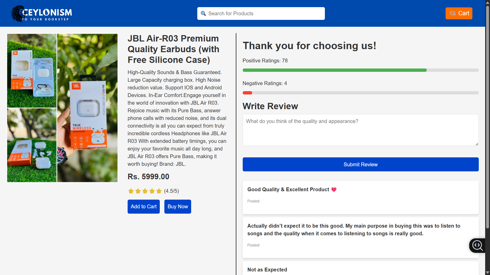
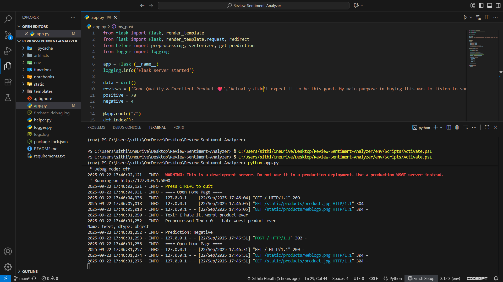

# 🛍️ **Product Review Sentiment Analysis Model (E-commerce Integration)**

The **Product Review Sentiment Analysis Model** is designed to automate the analysis of customer reviews for products on e-commerce websites. It utilizes machine learning techniques to classify sentiments (positive or negative) and provides businesses with actionable insights to improve product offerings and customer satisfaction.




---

## ✨ **Key Features**

✅ **Automated Sentiment Analysis**  
✅ **Real-time Sentiment Feedback for Products**  
✅ **Improved Customer Insights**  
✅ **Integrated Seamlessly with E-commerce Websites**  
✅ **Helps Enhance Product Quality and Customer Satisfaction**

---

## 🛠 **Tech Stack**

- 💙 **Python** – Programming language for data processing and machine learning
- 🔥 **Logistic Regression** – Sentiment classification model
- 📊 **Natural Language Processing (NLP)** – Text preprocessing and feature extraction
- 💾 **SQLite** – Database for storing product reviews and sentiment data
- 🌐 **Flask** – Web framework for integration with e-commerce websites

---

## 🚀 **How to Run**

1. **Install the required libraries**:

```bash
pip install numpy pandas scikit-learn flask nltk
